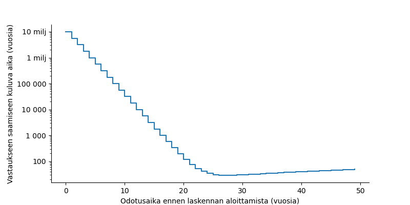

Douglas Adamsin romaanissa Linnunradan käsikirja liftareille eräs hyperälykäs ja yleisulottuvainen rotu on rakennattanut planeetan kokoisen supertietokoneen, joka suorittaa kymmenen miljoonan vuoden pituista ohjelmaa selvittäessään mikä oikeastaan on perimmäinen kysymys elämästä, maailmankaikkeudesta ja kaikesta muusta sellaisesta. Väitän, että paremmalla suunnittelulla he olisivat saaneet vastauksen selville huomattavasti nopeammin.

Supertietokoneiden laskentateho (maapallolla) on historian saatossa kasvanut hurjaa vauhtia. [Our World in Data -sivuston](https://ourworldindata.org/grapher/supercomputer-power-flops) mukaan laskentateho on kasvanut lähes kymmen miljoonakertaiseksi noin kolmenkymmenen vuoden aikana. Jos joku olisi kolmekymmentä vuotta sitten halunnut suorittaa ohjelman, jonka ajaminen sen aikaisilla tietokoneilla olisi kestänyt kymmenen miljoonaa vuotta, hänen olisi oikeastaan kannattanut odottaa tähän päivään asti ja käynnistää laskenta nykyajan supertietokoneella, jolla laskenta kestäisikin enää vain vuoden!

Lasketaanpa optimaalinen odotusaika tarkemmin. Keskimäärin supertietokoneiden laskentateho on 1,78-kertaistunut joka vuosi Our World in Datan tilaston mukaan. Toisin sanoen ensi vuoden mallilla kuluu tehtävän ratkaisemiseen vain (1/1,78 =) 56% siitä ajasta minkä tämän vuoden mallilta. Kahden vuoden päästä on saatavilla tietokone, jolla aikaa menee vain 0,56² eli 32 % alkuperäisestä ajasta ja niin edelleen.

Oletetaan, että tutkijalla on joka vuosi edessään valinta: hän voi joko käynnistää laskentatyön kyseisen vuoden tietokonemallilla tai odottaa seuraavan vuoden mallia ja sen parantunutta laskentatehoa. Laskenta on vietävä loppuun sillä tietokoneella, jolla se käynnistetään. Välitulosta ei siis voi tallentaa vuoden päästä ja siirtää nopeammalle koneelle (koodarit intoutuivat leikkimään generatiivisella tekoälyllä juuri kun heidän oli määrä toteuttaa kyseinen ominaisuus).

Jos tutkijalla on mielessään laskentatehtävä, joka veisi ensimmäisen vuoden tietokoneelta *a* vuotta, ja tutkija odottaa laskentatehon kasvua *n* vuotta ennen laskennan käynnistämistä, vastauksen saamiseen kuluu *n* vuotta odotusta ja *n*:nen vuoden tietokoneelta laskentaan kuluva aika eli *a * 0,56^n* vuotta. Yhteensä siis *n + a * 0,56^n* vuotta. Optimaalinen odotusaika on se *n*-arvo, joka minimoi kaavan arvon.

Alkuperäinen kymmenen miljoonan vuoden laskentatehtävän kanssa kannattaa odottaa 27 vuotta. Silloin vastauksen saamiseen menee yhteensä 27 + 10 000 000 * 0,56^27 = 28,7 vuotta. Jos odottaa 28 vuotta, niin vastauksen saamiseen menee hieman kauemmin (28,9 vuotta). Ohjelman suoritukseen kuluva aika alkaa nimittäin painua alle vuoden näillä paikkeilla. Ei kannata enää odottaa lisävuotta nopeampaa tietokonetta, jos sen tuoma parannus laskenta-ajassa on pienempi kuin odottamiseen käytetty vuosi. Seuraava kuvaaja näyttää pystyakselilla vastauksen saamiseen kuluvan kokonaisajan, kun ennen laskennan aloittamista odotetaan tietokoneiden kehitystä vaaka-akselin arvon mukainen määrä vuosia.

Voimme siis päätellä, että joko Linnunradan käsikirjassa liftareille esiintyvät planeetan kokoisen tietokoneen rakentajat ovat väitetystä hyperälykkyydestään huolimatta surkeita tieteellisen laskennan resurssien käytön suunnittelussa tai sitten fiktiivisten planeetankokoisten tietokoneiden laskentateho ei kasva samaan tahtiin kuin maanpäällisten supertietokoneiden.
