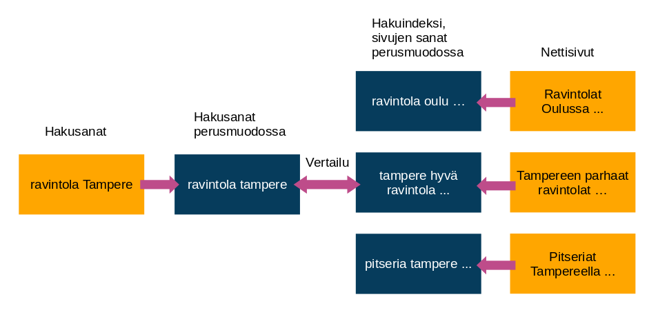

Hyvän hakukoneen pitää ymmärtää sanojen taivutukset ja johdokset. Jos haen hakusanoilla "ravintola Tampere", haluan saada hakutuloksiin mukaan myös sivun, jossa lukee "Tampereen parhaat ravintolat" vaikka kumpikaan hakusanoista ei esiinny sivun tekstissä sellaisenaan. Hakukoneissa taivutusmuodot käsitellään yleensä muuntamalla kaikki sanat ohjelmallisesti perusmuotoihinsa ennen vertailua. Perusmuotoistamisesta on hyötyä hakukoneiden lisäksi myös muissa sovelluksissa.

Sanan muuntaminen perusmuotoonsa eli ns. sanakirjamuotoon tarkoittaa mahdollisten taivutuspäätteiden ja johdinten poistoa ja sanan vartalon normalisointia, siis esimerkiksi sanan *kaupoista* muuntamista perusmuotoonsa *kauppa*. Perusmuotoistamista kutsutaan myös lemmatisoinniksi.

Perusmuotoistamiseen on kehitetty useita apuohjelmia ja ohjelmakirjastoja. Suomen kielen sanojen perusmuotoistamiseen ei ole olemassa yksikäsitteisiä sääntöjä. Siksi ongelmaan on kokeiltu vaihtelevin tuloksin useita erilaisia lähestymistapoja sanalistoista neuroverkkoihin. Kerron saatavilla olevista ohjelmista ja algoritmien toimintaperiaatteista tarkemmin tulevassa blogipostauksessa.

## Sovelluskohteita

Usein perusmuotoistamista käytetään tekstin esikäsittelynä. Sen tarkoituksena on normalisoida teksti poistamalla taivutuspäätteet, kun tärkeää on se mitä sanoja tekstissä esiintyy, ei tarkat taivutusmuodot. Usein esikäsittelyvaiheessa voidaan tehdä myös muuta normalisointia. Teksti voidaan esimerkiksi muuntaa pienaakkosiksi, jos kirjainkoon ei haluta merkitsevän jatkokäsittelyssä, tai tekstistä voidaan poistaa epäoleelliset välimerkit.

Alla oleva kuva havainnollistaa perusmuotoistamisen roolia hakukoneissa. Hakukone tallentaa nettisivujen sisällön hakuindeksiin. Indeksiin tallennettaessa kaikki sanat muunnetaan perusmuotoihinsa. Tiedonhakijan syöttämät hakusanat käsitellään vastaavalla tavalla. Hakukone vertailee esikäsiteltyjä hakusanoja jokaiseen hakuindeksiin tallennettu sivuun ja palauttaa vastauksena sivut, joissa esiintyy mahdollisimman monta samaa perusmuotoa kuin perusmuotoistetuissa hakusanoissa. Hakukone siis löytää oikeat sivut riippumatta hakusanoissa tai sivujen tekstissä käytetyistä taivutusmuodoista. Perusmuotoistaminen on suhteellisen hidasta isolle määrälle tekstiä. Senkin vuoksi on kannattavaa hakea perusmuodot etukäteen ja tallentaa ne hakuindeksiin. Hakukyselyä suoritettaessa tarvitsee perusmuotoistaa vain muutama hakusana.

Hakukoneiden lisäksi perusmuotoistamista hyödynnetään myös tekstinlouhinnassa, luokittelussa ja monissa muissa kieliteknologian sovelluksissa. Jos esimerkiksi halutaan opettaa luokitin tunnistamaan tekstin aihe, yleensä on paljon tärkeämpää mitä sanoja tekstissä esiintyy kuin täsmälliset taivutusmuodot. Se kertooko teksti puutarhasta vai elektroniikasta selviää käytetystä sanastosta, ei taivutusmuodoista.

Onko perusmuotoistamisesta sitten hyötyä? Useissa tutkimuksissa on todettu, että sanojen normalisointi auttaa parantamaan tiedonhaun osuvuutta merkittävästi erityisesti suomeksi ja muilla sanoja paljon taivuttavilla kielillä. Englannin kielessä vaikutus on yleensä paljon vaatimattomampi, koska englanninkielisessä tekstissä sanat esiintyvät huomattavasti useammin jo valmiiksi sanakirjamuodoissaan.

Aina perusmuotoistaminen ei ole oikea ratkaisu. Taivutusmuodot ovat tietenkin oleellinen osa kieltä, joten tietoa aina menetetään jos ne poistetaan. Rahanpesusta kertovien asiakirjojen analysoinnissa on huomattava ero siirtyivätkö rahat yrityksen tilille vai tililtä.

## Perusmuotoistamisen vaikeuksia

Sanan perusmuoto ei välttämättä ole yksikäsitteinen, ja oikea tulkinta saattaa vaatia lisätietoja kuten sanaluokan tuntemista tai tilastoja sanojen esiintyvyydestä. Sana *voimme* saattaa olla joko verbin *voida* tai substantiivin *voi* taivutusmuoto. Jos sanan rooli lauseessa ja sitä kautta sanaluokka tunnetaan, sanaluokka auttaa päättelemään kumpi on oikea tulkinta. Aina sanaluokan tunnistaminenkaan ei riitä. Sanan *vaihtolavat* perusmuoto on joko *vaihtolava* tai *vaihtolapa*, jotka molemmat ovat substantiiveja. Tällaisissa tapauksissa voi arvata, että yleisempi perusmuoto on todennäköisemmin oikea valinta. (*Vaihtolava* esiintyy noin sata kertaa useammin kuin *vaihtolapa* [nettisivuilta kerätyssä C4-aineistossa](../suomi-c4/).)

Täydellisyyttä on mahdotonta saavuttaa. Vaikka edelliset asiat ratkaisisikin, ongelmiksi jäävät edelleen esimerkiksi ulkomaiset erisnimet. Kielen käyttäjät voivat myös olla perustellusti eri mieltä siitä mitä sanan perusmuodolla edes tarkoitetaan. Onko esimerkiksi sana *vaikuttava* jo itsessään perusmuoto, vai onko sen perusmuoto sittenkin *vaikuttaa*, koska *vaikutta+va* on verbin *vaikuttaa* VA-partisiippimuoto? Käytännössä hyvään tarkkuuteen riittää, että oikea perusmuoto löytyy suurimmalla osalle sanoista.
