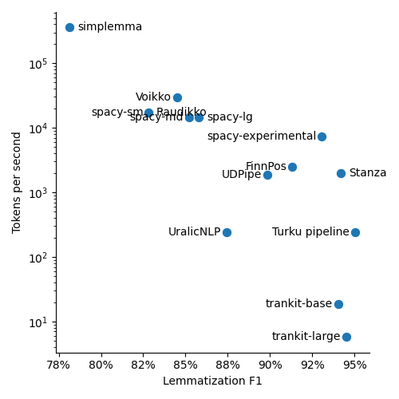

Tässä kirjoituksessa esittelen tapoja ja tekniikoita, joilla sanojen perusmuotoja haetaan ohjelmallisesti. [Edellisessä blogipostauksessa](../perusmuotoistaminen/) puolestaan kerroin miten sanojen perusmuotoistamista hyödynnetään hakukoneissa ja muissa kieliteknologian sovelluksissa.

Perusmuotoistamisen tarkoituksena on muuttaa tekstipätkän kaikki sanat perusmuotoihinsa eli ns. sanakirjamuotoihinsa. Siis esimerkiksi "Oulun houkuttelevimmat ravintolat" pitäisi muuttaa muotoon "Oulu houkutteleva ravintola". Vaikeutena on kielen epäsäännöllisyys. Tekstissä esiintyvästä sanan muodosta ei välttämättä pysty yksikäsitteisesti päättelemään sen perusmuotoa. Esimerkiksi sanan _voimme_ perusmuoto saattaa olla lauseyhteydestä riippuen joko _voi_ tai _voida_. Samankaltaiset sanat saattavat taipua eri taivutustyypin mukaan (_hurja_ > _hurj+i+a_ mutta _harja_ > _harjo+j+a_). Tunnetusti suomen kieli saattaa asetella paljon taivutustunnuksia, johtimia ja liitteitä sanan perään (_talo+i+ssa+mme+kaan+ko_). Päätteiden lisäksi myös sanan vartalo saattaa muuttua taivutetussa muodossa esimerkiksi astevaihtelun vuoksi (_ko**t**i_ > _ko**d**issa_). Yhdyssanat voivat aiheuttaa tulkintaongelmia: _asema+ssa_ vai _ase#massa_. Perusmuotoistimen pitää hallita nämä ja monta muutakin kielen ilmiötä.

Perusmuotoistamiseen on kehitetty aikojen saatossa useita eri tekniikoita. Käyn seuraavassa läpi niistä tärkeimpiä.

## Sanastoon perustuvat tekniikat

Yksinkertaisin ajatus perusmuotoistamiseen on koota laaja lista taivutetuista sanoista ja niiden perusmuodoista. Silloin perusmuotoistaminen onnistuu hakemalla taivutettua sanaa vastaava perusmuoto listalta.

Esimerkiksi [Voikko-kirjaston](https://voikko.puimula.org/) perusmuotoistaminen perustuu sanastoon. [Joukahainen-sanatietokantaan](https://joukahainen.puimula.org/) on kerätty suuri määrä yleisimpiä suomen kielen sanoja ja tieto mitä mallisanaa niiden taivutus noudattelee (esimerkiksi _naula_, _villa_ ja _paja_ taipuvat kaikki kuten _kala_). [Voikon sanalistanmuodostusskripti](https://github.com/voikko/corevoikko/tree/master/voikko-fi) generoi Joukahaisen tietokannan perusteella kaikki mahdolliset taivutusmuoto-perusmuoto-parit sisältävän sanalistan. Tarkemmin ottaen muodostettavaan listaan tallennetaan myös muuta morfologista tietoa mm. sanaluokasta ja sanan johtimista Voikon muita toiminnallisuuksia varten.

Kaikki sanaston sanojen taivutusmuodot sisältävä lista vaatii huomattavan paljon tilaa, ja pitkältä listalta hakeminen on hidasta. Sanastoa ei kannatakaan toteuttaa konkreettisena listana. Yleisesti käytetty ratkaisu (jota myös Voikko hyödyntää) on tiivistää taivutusmuoto-perusmuoto-parit [äärelliseksi transduktoriksi](https://en.wikipedia.org/wiki/Finite-state_transducer) (finite-state transducer, FST). Transduktorit ovat äärellisten automaattien yleistys. Siinä missä äärellinen automaatti ainoastaan kertoo kuuluuko annettu sana sanajoukkoon vai ei, transdukstori lisäksi muuntaa syötteenä annetun taivutetun sanan vastaavaksi perusmuotoiseksi sanaksi (tai oikeastaan merkkijonoksi, johon on koodattu muutakin morfologista tietoa sanasta), jos taivutusmuoto kuuluu tunnettujen sanojen joukkoon. Perusmuodon tarkistaminen transduktorista on nopeaa, ja transduktori saa pakattua suurenkin sanaston pieneen tilaan.

Selvänä heikkoutena sanastoon perustuvassa lähestymistavassa on, että se toimii vain niille sanoille, jotka on otettu mukaan sanastoon. Harvinaisten sanojen perusmuotoistaminen ei onnistu tällä menetelmällä.

## Sanan kontekstin huomioiminen

Kuten edellä todettiin, eri sanojen taivutusmuodot voivat johtaa samaan lopputulokseen. Onko sanan _voimme_ perusmuoto substantiivi _voi_ vai verbi _voida_? Jos pelkän sanan lisäksi on tiedossa sanaluokka, luku, sija tai kieliopillista tietoa sanan roolista lauseessa, voidaan todennäköisemmin valita oikea perusmuoto usean ehdokkaan joukosta. Usein perusmuotoistaminen tehdään osana laajempaa tekstianalyysiputkea, jolloin sanaluokka saattaa olla käytettävissä "ilmaiseksi".

[Mukautettu spaCy-kielimallini](https://github.com/aajanki/spacy-fi) hyödyntää Voikon sanastoon perustuvaa analyysiä ja [spaCyn](https://spacy.io/) päättelemää kieliopillista informaatiota. Jos Voikon analyysi palauttaa useita mahdollisia perusmuotoja, malli tarkistaa ensiksi voiko päätellyn sanaluokan perusteella valita niistä yhden. Jos perusmuodon yksilöinti sanaluokan perusteella ei onnistu, yrittää malli soveltaa paria muuta kieliopillista päättelysääntöä. Esimerkiksi lauseen objekti on yleensä partitiivissa, genetiivissä tai akkusatiivissa. Tämä sääntö saattaa auttaa rajaamaan useista vaihtoehdoista yhden.

## Sääntöpohjaiset tekniikat

Eräs toinen alkuun yksinkertaiselta vaikuttava idea on, että miksi ei vain poisteta tunnettuja taivutustunnuksia sanan lopusta. Esimerkiksi, jos sana loppuu _-ssa_, poistetaan pääte (_talossa_ > _talo_). Toiveena on, että säännöt toimisivat kaikille kielen sanoille, eivätkä olisi riippuvaisia siitä, mitkä sanat on otettu mukaan sanastoon.

Jos ajatusta miettii yhtään pidemmälle, huomaa nopeasti, että luonnollinen kieli on täynnä poikkeuksia, ja sen käsittely yksinkertaisilla säännöillä ei johda kovin hyvään tulokseen. Edellinen sääntö ei esimerkiksi toimi sanalle _kissa_; se on _-ssa_-loppuinen, mutta siitä ei pidä poistaa mitään.

Entäs sitten jonkinlainen yhdistelmä sanastoon ja sääntöihin pohjautuvista malleista? [Simplemma](https://github.com/adbar/simplemma) perustuu ennalta määriteltyyn sanastoon kuten Voikko, mutta lisää siihen päälle muutamia useimmissa tapauksissa toimivia sääntöjä (esimerkiksi, korvaa _-miseen_-pääte merkkijonolla _-minen_, eli: _huomiseen_ > _huominen_). Näin simplemma pystyy yleistämään jonkin verran määritellyn sanalistan ulkopuolelle. Ongelmaksi jää edelleen, että hyviä sääntöjä ei löydy helposti. Siksi sääntöominaisuuden kattavuus ja hyödyllisyys jää vähäiseksi.

Kattavien sääntöjen kirjoittaminen vaatisi paljon vaivaa ja huomattavaa kielitieteellistä osaamista.

## Muokkauspuut ja sääntöjen oppiminen

Jos toimivien perusmuotoistussääntöjen kirjoittaminen käsin on vaikeaa, niin voisiko niitä kenties oppia automaattisesti opetusaineistosta? Ehkä koneoppiminen pystyy oppimaan monimutkaisia sääntöjä, joita ihmisen on vaikea keksiä. Sääntöjen oppimista on kokeiltu useammalla erilaisella tavalla, jotka eroavat sen suhteen miten opittavat säännöt mallinnetaan.

Eräs tapa on esittää säännöt ketjuna yksinkertaisia sanan muokkausoperaatioita ja rajoituksia, jotka kertovat missä tilanteissa muokkauksia on sallittua tehdä. Valitsemalla muokkaukset ja niiden järjestys sopivasti saadaan niiden lopputuloksena yhdistetty sääntö, joka muuttaa sanan perusmuotoonsa. Muokkausoperaatioita voisivat olla esimerkiksi tietyn etu- tai jälkiliitteen poistaminen sanasta tai merkkijonon korvaaminen toisella.

Konkreettinen esimerkki tästä menetelmästä on [spaCyn](https://spacy.io/) käyttämä [neuraalinen muokkauspuuperusmuotoistin](https://explosion.ai/blog/edit-tree-lemmatizer). Muokkauspuu on tietorakenne, joka määrittelee merkkijonoon kohdistettavan muokkaussäännön. Yksinkertaisin muokkauspuu koostuu säännöistä sanan alku- ja loppupäiden tunnistamiseen ja korvaamiseen tietyllä merkkijonolla. Joissain kielissä (mutta ei välttämättä suomessa) on hyötyä, jos sääntö voi kohdistua rekursiivisesti sanan eri osiin. Siksi muokkauspuu on puu, jonka rakenne määrittelee mihin sanan osiin muokkausoperaatiot kohdistuvat. Puun lehtisolmut määrittelevät osamerkkijonon korvaussääntöjä (kuten edellä mainittu _-miseen_ > _-minen_). Jokainen sisäsolmu puolestaan jakaa merkkijonon kolmeen osaan. Sisäsolmun vasen lapsipuu määrittelee merkkijonon ensimmäisen osaan ja oikea lapsipuu viimeiseen osaan kohdistettavan operaation. Merkkijonon keskiosaa jätetään ennalleen.

Muokkauspuita on mahdollista oppia opetusaineistoista eli joukosta taivutusmuoto-perusmuoto-sanapareja. Opetusalgoritmi etsii kaikki muokkauspuut, jotka tarvitaan opetusesimerkkien taivutettujen muotojen muuntamiseksi perusmuotoihinsa. Yksi opittu muokkauspuu voisi esimerkiksi poistaa sanan lopusta _-lla_-päätteen (_talolla_ > _talo_) ja toinen puu voisi poistaa ensiksi _-kin_-päätteen ja edelleen jäljelle jäävästä merkkijonosta _-mme_-päätteen (_talommekin_ > _talomme_ > _talo_).

Kun muokkauspuita halutaan oppimisvaiheen jälkeen käyttää perusmuotoistamaan jokin sana, pitää valita sopiva puu opittujen puiden joukosta. Tutkijat ovat huomanneet, että valinnan tekijänä toimii hyvin luokitteluneuroverkko. Neuroverkolle annetaan syötteenä sanapiirteitä ja sanan kontekstia lauseessa kuvaavia piirteitä, ja verkko ennustaa mikä opituista muokkauspuista sopii sanan perusmuotoistamiseen. Valitun muokkauspuun sääntöjä sovelletaan sanaan ja lopputuloksena saadaan (toivottavasti) oikea perusmuoto. Jos valittu muokkauspuu ei sovellus sanaan (jos esimerkiksi valittu puu käskee poistamaan päätteen, jota sanassa ei ole), kokeillaan seuraavaksi todennäköisimpiä muokkauspuita kunnes joku niistä sopii sanaan.

Muokkauspuiden on osoitettu toimivan melko hyvin monilla kielillä, mutta ei kovin hyvin suomen kielellä. Luulen, että vaatimaton tarkkuus suomeksi johtuu siitä, että muokkauspuut eivät taivu helposti suomen kaltaisten taivutusmuodoiltaan rikkaiden kielten käsittelyyn. Esimerkiksi sanavartalon sisäinen astevaihtelu (_pöytä_ > _pöydät_) on vaikeaa esittää näillä muokkauspuilla.

## Jononmuokkausneuroverkot

Perusmuotoistamissääntöjen oppiminen onnistuu paremmin, jos puiden sijaan muokkausoperaatioiden kuvaamiseen käytetään jotain toista mallia, joka taipuu monipuolisempiin muokkauksiin. Usein käytetty vaihtoehto on [jononmuokkausneuroverkko](https://en.wikipedia.org/wiki/Seq2seq) (sequence-to-sequence, seq2seq).

Jononmuokkausneuroverkko käsittelee taivutettua sanaa kirjain kerrallaan, päivittää sisäistä tilaansa jokaisen kirjaimen jälkeen, ja tulostaa perusmuotoistetun sanan kirjain kirjaimelta. Toinen suosittu sovelluskohde jononmuokkausneuroverkoille on konekääntäminen. Kääntämiseen opetetun verkon syötteenä on teksti yhdellä kielellä ja tulosteena sama teksti käännettynä toiselle kielelle.

Perusmuotoistamiseen jononmuokkausneuroverkko opetetaan pareilla taivutettuja ja perusmuotoisia sanoja kuten muokkauspuutkin. Verkon oppimat muokkaussäännöt tallentuvat verkon sisäiseen tilaan ja verkon painokertoimiin, jotka päivittävät sisäistä tilaa jokaisen kirjaimen jälkeen. Jononmuokkausverkkojen oppimat säännöt ovat monipuolisempia kuin muokkauspuut, mutta myös paljon vaikeammin ihmisen tulkittavissa.

Turun yliopiston kieliteknologian tutkimusryhmän kehittämä [neuraalinen tekstin jäsennin](https://turkunlp.org/Turku-neural-parser-pipeline/) käyttää jononmuokkausneuroverkkoa perusmuotoistamiseen. Tarkemmin sanottuna jäsennin on enkooderi-dekooderi, joka käyttää LSTM-verkkoja sekä enkooderina että dekooderina. Syötepiirteinä on taivutetun sanan kirjainten lisäksi sanaluokka, luku, sija ja muita kieliopillisia piirteitä, jotka auttavat mallia valitsemaan oikean perusmuodon monitulkintaisille sanoille.

Toinen vastaava työkalu on Stanfordin yliopiston [Stanza](https://stanfordnlp.github.io/stanza/index.html). Se yhdistelee jononmuokkausneuroverkkoa ja sanastoon pohjautuvaa perusmuotoistinta. Opetusaineiston yleisimmät taivutusmuodot haetaan suoraan sanastosta ja harvinaisempia sanojen perusmuotoistamiseen opetetaan jononmuokkausverkko.

## Tasapainottelua tarkkuuden ja nopeuden välillä

Vertailin eri lähestymistapojen tarkkuutta [Universal Dependencies (UD) -puupankin](https://universaldependencies.org/) suomenkielisellä aineistolla. Aineistossa kielitieteilijät ovat annotoineet suuren joukon eri lähteistä kerättyjä lauseita ja mm. kirjanneet oikeat perusmuodot teksteissä esiintyville sanoille. UD-aineisto on jaettu opetus- ja testijoukkoihin. Tein vertailun testijoukolla. Monet vertailtavista malleista on opetettu UD:n opetusjoukolla, eli tämä vertailu todennäköisesti yliarvioi jonkin verran millaista tarkkuutta on odotettavissa UD:n aiheista poikkeavalla aineistolla.

Vertailu on tehty huhtikuussa 2022. Joidenkin mallien suorituskyky on voinut muuttua sen jälkeen. Ohjeet vertailun toistamiseen ja vertailtavien mallien tarkat versionumerot löytyvät [vertailun lähdekoodeista](https://github.com/aajanki/finnish-pos-accuracy).

Sovellusten kannalta on kiinnostavaa paitsi oikein menevien perusmuotojen osuus myös suoritusnopeus. Seuraavassa kuvassa on esitetty perusmuotoistamisen tarkkuus vaaka-akselilla (oikein ja väärin menneiden perusmuotojen [F1-pisteytys](https://en.wikipedia.org/wiki/F-score), suurempi lukuarvo on parempi) ja pystyakselilla suoritusaika (kuinka monta sanaa malli perusmuotoistaa sekunnissa, logaritminen skaala, suurempi lukuarvo on parempi). Malli on siis sitä parempia mitä lähempänä oikeaa yläkulmaa sen tulokset ovat.

Kuvassa osasta malleista on käytettä lyhennettyjä nimiä. Spacy-sm, spacy-md, spacy-lg ovat spaCyn muokkauspuuta käyttävät perusmuotoistimet (pieni, keskisuuri ja suuri parametrisointi). Spacy-experimental on muokattu spaCy-malli, joka ei käytä muokkauspuuta vaan yhdistää Voikon sanastoperustaisen mallin sanaluokkaa hyödyntäviin sääntöihin. "Turku pipeline" on Turun yliopiston neuraalinen tekstin jäsennin. Kuvassa on mukana myös malleja, joita ei ole mainittu tässä kirjoituksessa.

Kuvasta käy ilmi pari mielenkiintoista seikkaa. Ensinnäkin mikään malli ei selkeästi voita vertailua. Mallin valinnassa joutuu tasapainottelemaan tarkkuuden ja nopeuden välillä. Mallit simplemma, Voikko, spaCy-experimental, Stanza ja Turku pipeline muodostavat eräänlaisen Pareto-rintaman. Jos haluaa parempaa tarkkuutta, joutuu vaihtamaan hitaampaan malliin.

Toinen huomionarvoinen asia on, että puristettaessa tarkkuudesta aivan parhaimmat tulokset, kasvaa suoritusaika jyrkästi. Esimerkiksi spacy-experimental ja Turku pipeline -mallien perusmuotoistustarkkuudessa (tai tarkemmin sanottuna F1-pisteissä) on vain parin prosenttiyksikön ero, mutta tarkempi Turku-malli on monta kymmentä kertaa hitaampi.

Suoritin vertailut neliytimisellä CPU:lla. Osa malleista pystyy hyödyntämään rinnakkaisia ytimiä. Neuroverkkoihin perustuvat mallit toimisivat mahdollisesti nopeammin GPU:lla ainakin, jos sovellus on sellainen, että perusmuotoistus tehdään suurelle määrälle dokumentteja kerrallaan. En kuitenkaan kokeillut GPU:lla ajamista.

## Yhteenveto

Tässä kirjoituksessa esittelin eri tekniikoita sanojen perusmuotoistamiseen. Tekniikoita on kehitetty monta, koska ei ole olemassa yksittäistä ylivertaista tekniikkaa, vaan niiden välillä on tehtävä valintoja käyttötarkoituksen mukaan. Tarkempia tuloksia tuottavat mallit ovat hitaampia. Jos on valmis sallimaan jonkin verran virheitä, löytyy kertaluokkia nopeampia malleja.

Nopeuden ja tarkkuuden lisäksi perusmuotoistamisen tekniikoita voi luokitella myös toimintaperiaatteen mukaan. Eräs luokittelu on avoin vs. suljettu sanasto. Suljetun sanaston mallit (kuten Voikko) toimivat vain etukäteen määritellyn sanalistan sanoilla, mutta osaavat perusmuotoistaa ne oikein. Avoimen sanaston mallit (kuten Turun yliopiston jäsennin) pyrkivät oppimaan kielen perusmuotoistamissäännöt muodossa, jota voidaan soveltaa mihin tahansa sanaan. Hintana on, että sääntöjen oppiminen rajallisesta esimerkkijoukosta on vaikeaa, ja malli todennäköisesti oppii myös vääriä sääntöjä ja tekee siis virheitä.

Toinen luokittelutekijä on onko syötteenä pelkästään taivutettu sana vai sanan lisäksi myös sanaluokka tai muuta kontekstitietoa. Pelkkää sanaa käyttävät tekniikat eivät aina pysty löytämään oikeaa perusmuotoa, koska useat sanat voivat taivutettuina saada saman tekstimuodon. Sanaluokka voi auttaa yksilöimään oikean perusmuodon, mutta sen sisällyttäminen monimutkaistaa mallia ja myös tekee siitä hitaamman.
