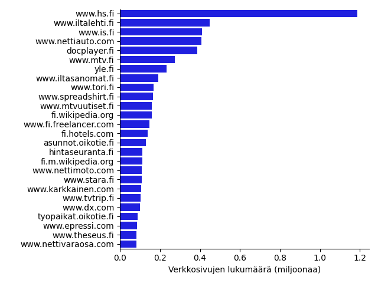
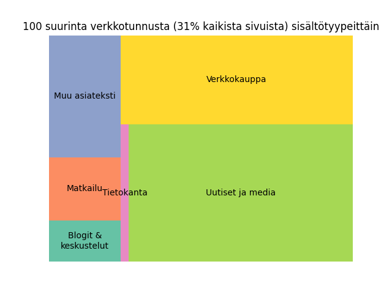

+++
title = "Suomenkielisen webbiaineiston analysointia"
date = "2023-05-21T17:09:32+03:00"
description = "Analysoin verkkosivuja kokoavan C4-aineiston suomenkielistä sisältöä"
tags = []
+++

## Tekoäly oppii vain sen mitä opetusaineistossa on

ChatGPT ja muut iso tekoälyjärjestelmät opetetaan valtavalla määrällä ihmisten kirjoittamia tekstejä. Usein opetusaineistoon sisältyy iso kasa Internetistä imuroitua nettisivujen tekstisisältöä.

Tutkin tässä kirjoituksessa mitä Colossal Clean Crawled Corpus (C4) -aineiston suomenkielinen osuus sisältää. C4 on iso kokoelma nettisivujen tekstejä. Sivut on kerätty webistä automaattisesti linkkejä seuraavan indeksointirobotin avulla. Myös hakukoneet perustuvat samanlaiseen netin indeksointiin. Jokaisen sivun kieli on tunnistettu kielentunnistimella.

[Washington Post](https://www.washingtonpost.com/technology/interactive/2023/ai-chatbot-learning/) ja [Allen AI:n ja Hugging Facen tutkijat](https://arxiv.org/abs/2104.08758) ovat selvitelleet C4:n englanninkielisiä sisältöjä, mutta tietääkseni suomenkielisestä osuudesta ei ole julkaistu analyysiä aikaisemmin.

On tärkeää ymmärtää millä aineistoilla järjestelmät on opetettu. Tekoälyllä ei ole maalaisjärkeä. Se pystyy vain toistamaan samanlaisia tekstipätkiä ja rakenteita kuin mitä opetusaineistossa on. Kaikenlaiset vinoumat aineistossa voivat heijastua järjestelmän tuotoksissa. Jos opetusaineistosta esimerkiksi puuttuisivat kokonaan runot, ei tekoäly olisi kovin hyvä tuottamaan runomuotoisia tekstejä. Tai jos opetukseen käytettäisiin paljon loukkaavaa kieltä sisältävää tekstiä, tekoäly todennäköisesti alkaisi tuottamana loukkaavia sanontoja sisältävää tekstiä.

En tiedä onko C4:n suomenkielisiä tekstejä käytetty minkään tekoälyjärjestelmän opettamiseen. Opetusaineistot ovat yritysten salaisuuksia. Esimerkiksi [OpenAI ei paljasta millä aineistolla GPT-4 on opetettu](https://www.theverge.com/2023/3/15/23640180/openai-gpt-4-launch-closed-research-ilya-sutskever-interview). Hyvin todennäköisesti kuitenkin tämänkaltainen webistä kerätty sisältö muodostaa merkittävän osan kaikkien nykyisten tekoälyjen opetusaineistosta.

## Yleisimmät verkko-osoitteet suomenkielisessä C4:ssä

C4:n suomenkielinen osuus koostuu 26 miljoonasta nettisivusta ja sisältää 85 gigatavua tekstiä. Sisältö on kerätty vuosien 2014 ja 2020 välillä painottuen erityisesti vuodesta 2017 eteenpäin. Aineistosta on siivottu pois ylimääräiset kaksoiskappaleet, jos sama sisältö esiintyy useammalla sivulla (esimerkiksi peilatut kopiot Wikipediasta).

Alla on listattu aineiston yleisimmät suomenkieliset verkkotunnukset ja niiden sivumäärät.

Kolme yleisintä verkko-osoitetta aineistossa ovat kaikki uutissivustoja: www&period;hs&period;fi, www&period;iltalehti&period;fi ja www&period;is&period;fi. Hieman yllättäen neljänneksi yleisin sivusto on käytettyjä autoja välittävä nettiauto.com. Kärjestä löytyy muitakin yllättäviä sivustoja. Esimerkiksi eräs paitoja painattava ja myyvä kauppa on yli 160&nbsp;000 sivullaan aineiston kymmenenneksi yleisin verkkotunnus, mutta Wikipedia tulee vasta sijalla 12. Verkkokauppojen sijoituksia nostaa se, että jokainen myytävä tuote on indeksoitu aineistoon omana sivunaan.

## Uutiset suurimpana sisältöryhmänä

Luokittelin käsin 100 aineistossa useimmin esiintyvää verkko-osoitetta niiden sisällön tyypin mukaan. Ne kattavat 31% kaikista aineiston sivuista. Luokat ja niiden suhteelliset koot on esitetty kuvassa alla.

Suurin ryhmä ovat **uutis- ja mediasivustot**. Tähän laskin mukaan varsinaisten uutisten lisäksi tiedotteet, viihdeuutiset ja Yle Areenan sisällön. Näillä sivustoilla teksti on yleiskieltä.

**Verkkokaupat** muodostavat lähes yhtä suuren ryhmän. Tähän kuuluu paljon tuote-esittelysivuja. Niiden pääasiallisena sisältönä on erilaiset listaukset tuotteiden ominaisuuksista ja käyttäjien kirjoittamat lyhyet tuotearvostelut. Nämä sivut sisältävät paljon ranskalaisia viivoja ja vähemmän kokonaisia lauseita kuin uutissivustot. Ne sisältävät myös paljon enemmän sekakielistä tekstiä kuin muut luokat. Yhdellä sivulla voi olla tuotearviointeja suomen lisäksi muillakin kielillä. Suurimpina sivustoina tässä ryhmässä ovat www&period;nettiauto&period;com (4. suurin verkkotunnus sivujen määrän mukaan järjestettynä), www&period;tori&period;fi (9.) ja www&period;spreadshirt&period;fi (10.).

**Matkailusivustot** ovat myös yllättävän isossa roolissa. Tähän ryhmään otin mukaan hotelli- ja lentovaraussivustot. Nämä sivut muistuttavat rakenteeltaan verkkokauppoja siinä mielessä, että sisältö on listausmaisia hotellien ja matkakohteiden esittelyjä ja arviointeja. Suurimmat sivustot ovat fi&period;hotels&period;com (14.), www&period;tvtrip&period;fi (21., ei enää toiminnassa) ja www&period;fi&period;kayak.com (28.).

**Blogit ja keskustelualueet** koostuvat Internet-käyttäjien itse julkaisemasta sisällöstä. Niiden teksti on usein selvästi uutisia puhekielimäisempää, oikeinkirjoituksen suhteen löyhempää ja sisältää paljon enemmän hymiöitä kuin muut asiatekstit. Aiheet vaihtelevat päiväkirjamaisista merkinnöistä poliittiseen kommentaariin ja kaikkeen siltä väliltä. Suurimmat blogit ja keskustelualueet ovat www&period;lily&period;fi (33.), blogivirta&period;fi (39.) ja www&period;tiede&period;fi (40.).

**Muu asiateksti** -luokkaan kokosin sekalaisia, muihin ryhmiin sopimattomia asiatekstejä, mm. Wikipedian artikkelit (pääsivusto 12. ja mobiilisivusto 17.), työpaikkailmoituksia (esim. www&period;fi&period;freelancer&period;com 13.), opinnäytetöitä (www&period;theseus&period;fi 25.) ja lakitekstejä (www&period;edilex&period;fi 91.).

**Tietokantaluokkaan** ryhmittelin sivustot, jotka toimivat käyttöliittymänä erilaisiin tietokantoihin. Tähän kuuluu esimerkiksi paikkakuntakohtaiset sääennustussivut (www&period;foreca&period;fi 82.), päivittäiset tv-ohjelmalistaukset (www&period;iltapulu&period;fi 41.) ja lähes 40&nbsp;000 sivua (!) pilkkimispelin tuloslistauksia (propilkki&period;ddns&period;net 47., ei enää toiminnassa). Näissä toistuu usein sama perusrakenne sivusta toiseen vain osan sisällöstä vaihdellessa. Sivut eivät sisällä paljoakaan kokonaisia lauseita.

Mielenkiintoista on myös se mitä C4-aineistosta puuttuu. Twitteristä (7335.), Redditistä (12119.) ja Facebookista (17053.) on kustakin mukana vain joitain satoja sivuja. Trollauksesta ja vihapuheen levittämisestä tunnetusta Ylilauta-keskustelualustasta on mukana vain kaksi sivua. Ilmeisesti nämä sivustot estävät sisältöjensä automatisoidun keräämisen.

## Pieni osa spämmiä ja rikkinäisiä sivuja

Tutkin sivujen sisältöä ja teknistä laatua myös poimimalla 1000 satunnaista sivua lähempään tarkasteluun. Otokseni perusteella noin 3% sivuista on selkeitä spämmisivuja vaikka aineiston keräämisen yhteydessä on jo yritetty suodattaa spämmi pois. Laskin spämmiksi sivut, jotka lähinnä vain listaavat avainsanoja hakukoneosumien toivossa, ja huonosti konekäännetyt, täysin rikkinäisellä suomen kielellä kirjoitetut sivut. Verkkokauppojen tuotesivuja en laskenut spämmiksi.

Osalla sivusta ääkköset ovat "rikki". Tällä tarkoitan että Ä- ja Ö-kirjainten tilalla on joitain täysin vääriä merkkejä, koska webbisivun metatietoihin on erehdyksessä merkitty väärä koodaustapa. Otokseni perusteella C4-aineistossa noin 1% webbisivuista on tällainen ongelma. C4-aineistossa on pyritty poimimaan webbisivuilta vain leipäteksti. Oleellisen tekstin tunnistaminen ei välttämättä aina ole ihan helppoa ja noin 1% sivuista tekstin sekaan on jäänyt sivun rakennetta kuvaavia HTML-tunnisteita tai JavaScript-koodia.

Aineiston kokoajan tekemä koneellinen kielentunnistus ei ole täysin virheetöntä. Ajoin C4:n jokaisen sivun kahden toisistaan riippumattoman kielentunnistimen läpi sillä ajatuksella, että jos kaikki kolme tunnistusta (C4:n alkuperäinen tunnistin ja minun käyttämäni kaksi tunnistinta) luokittelevat kielen suomeksi, niin tunnistus on todennäköisemmin oikein kuin, jos vain yksittäinen tunnistin väittää kielen olevan suomea. Noin 97% sivuista kaikki tunnistimet olivat samaa mieltä, että sivu on suomea. Kävin läpi satunnaisotannan lopuista 3% sivuista ja totesin, että monet niistä joko olivat jotain muuta kieltä kuin suomea tai sisälsivät pitkiä pätkiä muitakin kieliä kuin suomea.

[Analyysissä käyttämäni lähdekoodi](https://github.com/aajanki/mc4-fi-analysis) on saatavilla.
